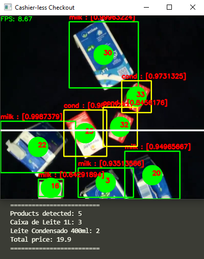

# MILK Detector - Market Item Labeling Kernel Detector 

## v1

  

## v2

  

Tracker code is a modified version of <a href="https://pysource.com/2021/01/28/object-tracking-with-opencv-and-python/">this one</a> by Sergio Canu
